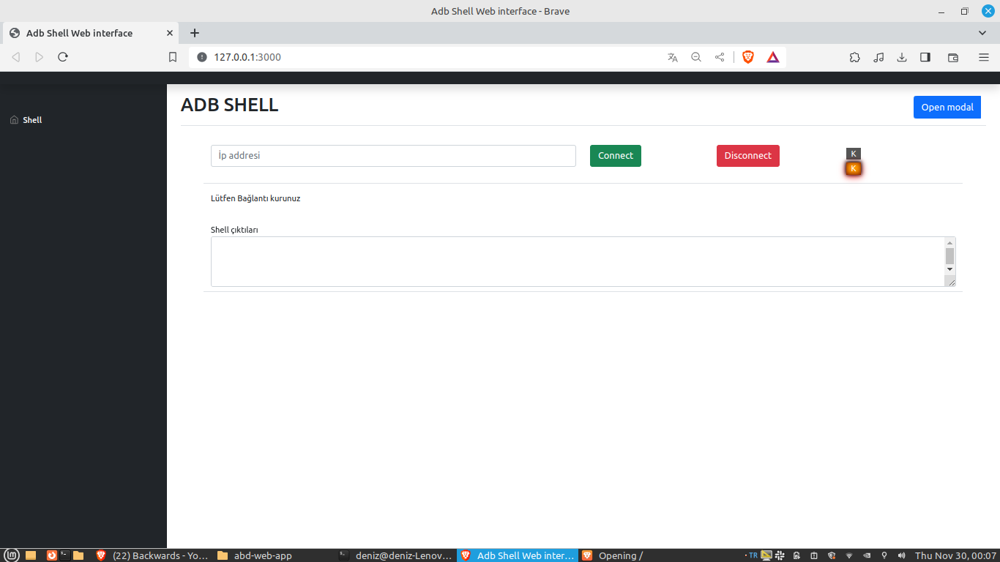

# adb-web-app




# İhtiyaçlar
 Kullanıcı tarafından IP yazıldığı vakit aşağıdaki komutlar butonlar ile çalışacaktır.
 - SHUTDOWN,
 - RESTART
 - APP CLOSE
 - APP OPEN
 - APP INSTALL
 - APP UNINSTALL
 - APP LİST 


## Virtualenv Hazırla
```
$ virtualenv venv
$ source venv/bin/activate

```

## Paketleri Kur
```

(venv)... $  pip install -r requirements.txt

```
## uygulama çalıştırma

```
uvicorn main:app --reload

```

## döküman oluşturma
```
pdoc --html ./lib.py -o ./Docs --force
```

## ip ekleme
```
adb tcpip 5555
```
```
adb connect 192.168.0.11:5555
```
```
adb devices
```

## Shell kullanımı(örnek)
Lib klasörü içerisinden aşağıdaki komut satırı ile shelli çalıştırabilirsiniz
```
source shell.sh ;DetailDevices
```
## pytest 

aşağıdaki komut ile çalıştırabilirsiniz.
```
pytest test_main.py 
```
## uygulama baslatma (root olmak gerekli)
https://stackoverflow.com/questions/4567904/how-to-start-an-application-using-android-adb-tools/4567928#4567928


port tarat

